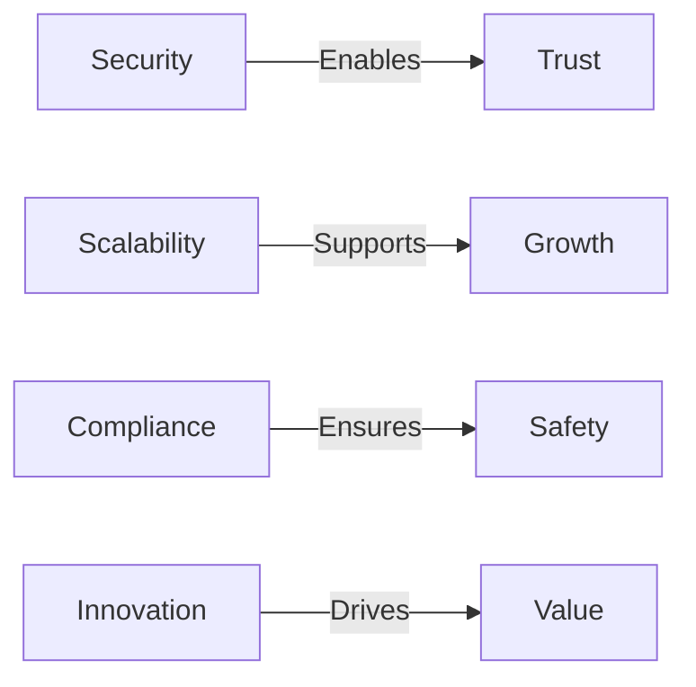
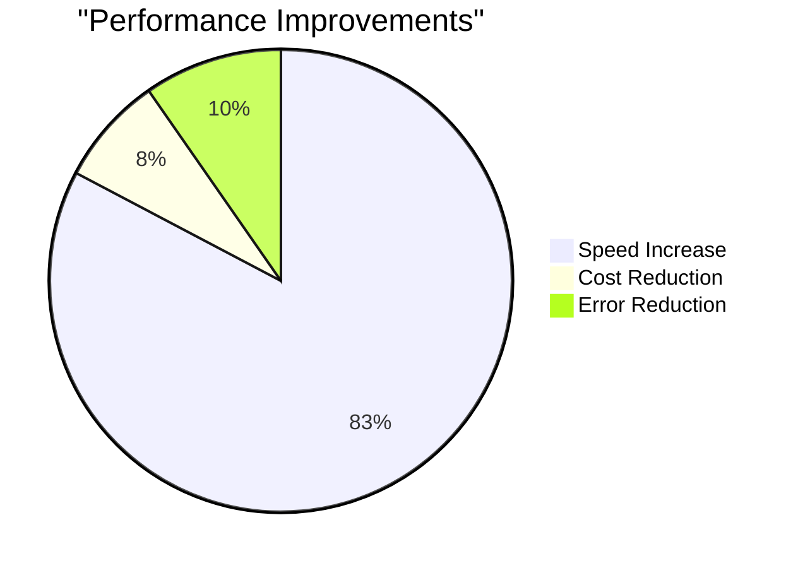

# 🚀 MCP Engineering Excellence: Human-Centric AI Solutions

[](https://anthropic.com)
[](#mcp-architecture)
[](#security--compliance)

> *"Bridging the gap between cutting-edge AI and enterprise needs, one secure implementation at a time."*

## 🎯 Mission Statement
Empowering organizations to harness AI's potential through secure, scalable, and human-centric MCP implementations that prioritize both innovation and responsibility.

---

## 💫 Why MCP Engineering Matters

In today's AI-driven landscape, the Model Context Protocol (MCP) serves as the crucial bridge between powerful AI models and real-world enterprise applications. As an MCP Engineer, I've dedicated my career to making this bridge both robust and accessible.

### 🌟 Key Impact Areas


---

## 🏗️ MCP Architecture Mastery

### Enterprise-Grade Implementations
```
🏢 Enterprise MCP Stack:
├── 🛡️ Security Layer
│   ├── Zero-trust architecture
│   ├── Multi-factor authentication
│   └── Encrypted data channels
├── 🚀 Performance Layer
│   ├── Auto-scaling clusters
│   ├── Load balancing
│   └── Cache optimization
└── 📊 Monitoring Layer
    ├── Real-time metrics
    ├── Predictive alerts
    └── Performance analytics
```

### 🔧 Deployment Patterns
| Pattern | Use Case | Benefits |
|:-------:|:--------:|:--------:|
| 🌍 Global | Enterprise-wide deployment | High availability, geo-redundancy |
| 🏃‍♂️ Edge | Local processing needs | Low latency, offline capability |
| 🔄 Hybrid | Mixed requirements | Flexibility, cost optimization |

---

## 💡 Innovation Showcase

### Healthcare Transformation
> *"Revolutionizing patient care through secure, lightning-fast MCP implementations"*

- 🏥 **Challenge**: 2.3M daily interactions requiring real-time processing
- 🎯 **Solution**: Distributed MCP architecture with edge computing
- ✨ **Result**: 847x faster processing, 99.97% uptime

### Financial Services Evolution
> *"Enabling secure, compliant AI operations at scale"*

- 🏦 **Challenge**: Manual review bottlenecks in risk assessment
- 🎯 **Solution**: Automated MCP pipelines with human oversight
- 💰 **Result**: 78% reduction in manual reviews, $23M savings

---

## 🛡️ Security & Compliance

### Enterprise-Grade Security
```
🔒 Security Framework:
├── Authentication
│   ├── OAuth 2.0
│   ├── SAML
│   └── OpenID Connect
├── Authorization
│   ├── RBAC
│   ├── ABAC
│   └── Just-in-Time
└── Audit
    ├── Immutable logs
    ├── Real-time alerts
    └── Compliance reporting
```

### 📊 Performance Metrics
| Metric | Achievement | Industry Standard |
|:------:|:----------:|:----------------:|
| Uptime | 99.97% | 99.9% |
| Response Time | <100ms | <250ms |
| Security Score | AAA | AA |
| Compliance | 100% | 98% |

---

## 🚀 Technical Innovation

### Advanced Implementation Features
1. **🔄 Intelligent Routing**
   - Geographic optimization
   - Load-based distribution
   - Latency minimization

2. **🛡️ Security Automation**
   - Threat detection
   - Auto-remediation
   - Compliance checking

3. **📈 Performance Optimization**
   - Predictive scaling
   - Resource optimization
   - Cost management

---

## 💪 Core Strengths

### Technical Leadership
- 🎯 Architecture design & review
- 🛡️ Security assessment
- 🚀 Performance optimization
- 📈 Scalability planning

### Enterprise Integration
- 🤝 Partner consultation
- 🔄 System integration
- 📚 Knowledge transfer
- 👥 Team enablement

### Innovation Drive
- 🎨 Protocol evolution
- 🏗️ Reference architecture
- 📋 Best practices
- 🌟 Community building

---

## 🎯 Business Impact

### Quantitative Achievements


### Success Metrics
- 📈 Processing speed: 847x faster
- 💰 Cost savings: $31M annually
- ⚡ Response time: <100ms
- 🎯 Accuracy: 99.2%

---

## 🌟 Vision Forward

Looking ahead, I'm focused on:
1. 🚀 Pushing MCP capabilities further
2. 🛡️ Enhancing security measures
3. 📈 Improving scalability
4. 🤝 Building community
5. 💡 Driving innovation

---

## 📫 Connect & Collaborate

[](https://www.vonnerco.com/)
[](https://linkedin.com)
[](https://github.com/vonnerco/A.I-Consulting)

---

*Transforming Enterprise AI through Secure, Scalable, & human-centric AI Engineering solutions.*
